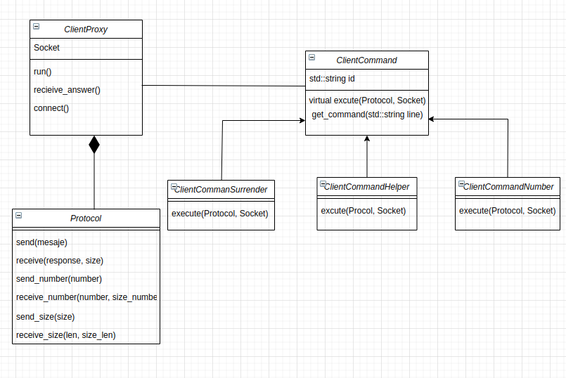
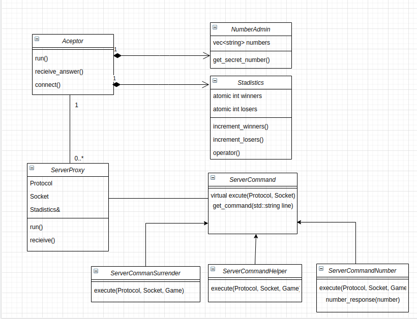

# tp3

* Nombre y apellido: Agostina Vásquez
* Padrón: 99689
* Link al repositorio: https://github.com/agosvasquez/tp3

A continuación se describirán las clases más importantes:

*Protocolo: Tiene la responsabilidad de serializar, deserializar y enviar/recibir 
los mensajes. 

*ClientCommand: Tiene la responsabilidad de tener/procesar el mensaje a enviar al servidor.
 De esta clase heredan ClientCommandNumber, ClientCommandHelper, ClientCommandSurrender.

*ServerCommand: Tiene la responsabilidad de tener/procesar el mensaje a enviar al cliente.
 De esta clase heredan ClientCommandNumber, ClientCommandHelper, ClientCommandSurrender.

*ClientProxy: Es quien encapsula la lógica del llamado a los comandos, por y es quien
procesa el mensaje ingresado por consola y devulve la respuesta al cliente.

*ServerProxy: Es quien encapsula la lógica del llamado a los comandos, por y es quien
procesa el mensaje ingresado por consola y devulve la respuesta al servidor.

*Aceptor: Es quien acepta los nuevos clientes en el servidor. 

